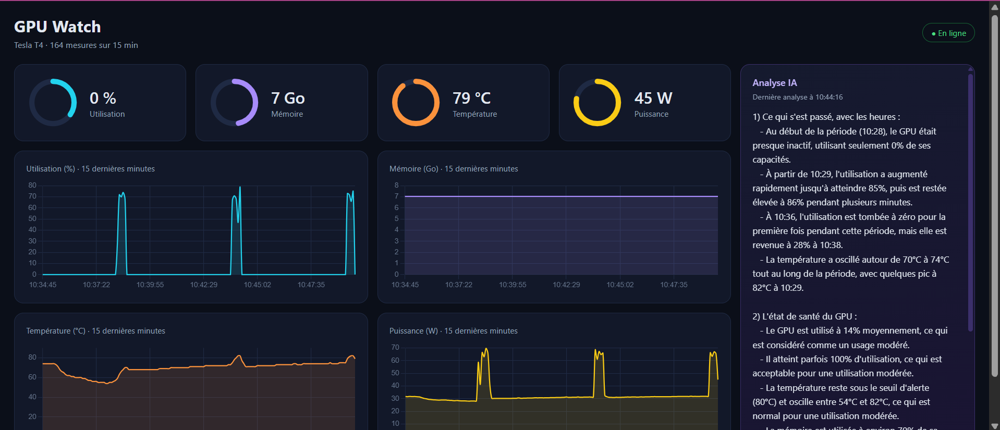
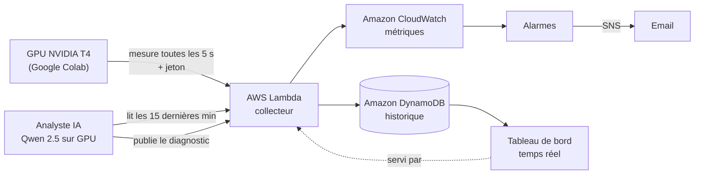

# GPU Watch

**Plateforme de surveillance GPU en temps réel, avec un analyste IA qui explique ce qui se passe.**

GPU Watch collecte les métriques d'un GPU NVIDIA toutes les 5 secondes, les stocke sur AWS, les affiche dans un tableau de bord temps réel, déclenche des alertes par email et produit des diagnostics automatiques en français grâce à un modèle de langage open source qui tourne… sur le GPU qu'il surveille.



---

## Fonctionnalités

- **Collecte de métriques GPU** : utilisation, mémoire, température et consommation électrique, lues via `nvidia-smi`
- **API serverless sécurisée** : une fonction AWS Lambda reçoit les mesures, protégée par un jeton d'authentification
- **Historique** : stockage des séries temporelles dans Amazon DynamoDB
- **Tableau de bord temps réel** : jauges et courbes des 15 dernières minutes, actualisées toutes les 5 secondes
- **Alertes** : alarmes Amazon CloudWatch (surchauffe, inactivité prolongée) avec notification par email via Amazon SNS
- **Analyste IA** : un LLM open source (Qwen 2.5, 3 milliards de paramètres) lit les métriques et rédige un diagnostic

## Architecture



Une seule fonction Lambda joue trois rôles, selon la requête :

| Requête | Rôle |
|---|---|
| `POST /` avec en-tête `x-jeton` | Réception d'une mesure ou d'un diagnostic IA |
| `GET /` | Page du tableau de bord |
| `GET /?donnees=1` | Mesures des 15 dernières minutes (JSON) |
| `GET /?analyse=1` | Dernier diagnostic de l'IA (JSON) |

## Choix techniques

- **Serverless (Lambda) plutôt qu'un serveur** : aucun coût quand rien ne tourne, aucune machine à maintenir. Adapté à un trafic irrégulier.
- **DynamoDB avec clé `gpu` + `horodatage`** : récupérer « les 15 dernières minutes d'un GPU » est une simple requête sur la clé de tri, sans parcourir toute la table. Les diagnostics IA sont rangés dans la même table sous la clé `analyse:<gpu>`, sans se mélanger aux mesures.
- **Python calcule, l'IA raconte** : les petits modèles de langage sont fiables pour rédiger mais se trompent souvent dans les comparaisons de nombres. Les statistiques et les dépassements de seuil sont donc calculés en Python et fournis tout prêts au modèle.
- **Secrets hors du code** : le jeton est lu depuis les variables d'environnement Lambda et les Secrets Colab, jamais écrit dans le dépôt.
- **Moindre privilège** : la politique IAM fournie (`aws/iam-policy.json`) n'autorise que les actions nécessaires sur la seule table du projet.

## Structure du dépôt

```
gpu-watch/
├── lambda/
│   └── lambda_function.py    # Collecteur + API + tableau de bord
├── colab/
│   └── gpu_watch_colab.py    # Capteur, charge de test et analyste IA (cellules Colab)
├── aws/
│   └── iam-policy.json       # Permissions minimales de la fonction Lambda
└── docs/
    └── dashboard.png
```

## Installation

### 1. Côté AWS

1. **DynamoDB** : créer une table `gpu-watch-mesures`, clé de partition `gpu` (chaîne), clé de tri `horodatage` (chaîne).
2. **Lambda** : créer une fonction Python 3.13, coller le contenu de `lambda/lambda_function.py`.
   - Variables d'environnement : `TABLE=gpu-watch-mesures` et `JETON=<un jeton secret>`
   - Rôle d'exécution : permissions de `aws/iam-policy.json`
   - Créer une **URL de fonction** (authentification `NONE` : la sécurité est assurée par le jeton pour l'écriture)
3. **CloudWatch** : créer deux alarmes sur l'espace de noms `GPUWatch`, reliées à une rubrique SNS avec votre email :
   - `gpu-surchauffe` : `Temperature` (maximum sur 1 min) > 80
   - `gpu-inactif` : `Utilisation` (moyenne sur 5 min) < 10, pendant 2 périodes sur 2

Générer un jeton secret :
```python
import secrets; print(secrets.token_hex(16))
```

### 2. Côté Google Colab

1. Ouvrir un carnet avec un GPU (*Exécution > Modifier le type d'exécution > T4 GPU*).
2. Dans les **Secrets** Colab, ajouter `GPU_WATCH_URL` (URL de la fonction) et `GPU_WATCH_JETON`.
3. Copier les cellules de `colab/gpu_watch_colab.py` et les exécuter dans l'ordre.
4. Ouvrir l'URL de la fonction dans un navigateur : le tableau de bord s'affiche.

## Coûts

Conçu pour rester dans l'offre gratuite AWS : Lambda et DynamoDB sont sollicités très faiblement, et seules deux métriques personnalisées sont envoyées à CloudWatch. Le GPU est fourni gratuitement par Google Colab.

## Pistes d'amélioration

- Déployer toute l'infrastructure avec **CloudFormation** ou **Terraform**
- Surveiller **plusieurs GPU** (sélecteur dans le tableau de bord)
- Remplacer le jeton partagé par une authentification **IAM** ou **Cognito**
- Faire tourner le capteur sur une instance **EC2 GPU** avec l'agent CloudWatch
- Purge automatique des anciennes mesures avec le **TTL** DynamoDB

## Limites

Projet personnel d'apprentissage, non destiné à la production. L'analyste IA est un petit modèle : ses diagnostics doivent être relus par un humain.

---

**Technologies** : AWS Lambda · Amazon DynamoDB · Amazon CloudWatch · Amazon SNS · IAM · Python · JavaScript · Chart.js · NVIDIA CUDA · Hugging Face Transformers · Qwen 2.5
