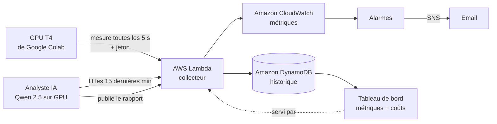

# GPU Watch

**Surveillance d'un GPU en temps réel : température, utilisation, mémoire et consommation, avec alertes et diagnostic rédigé par IA.**

Le projet a été réalisé avec le GPU T4 mis à disposition gratuitement par **Google Colab** : aucun GPU n'a été acheté ni loué. Toutes les 5 secondes, GPU Watch lit son état avec l'outil `nvidia-smi` fourni par Colab : **température**, **taux d'utilisation**, **mémoire occupée** et **puissance consommée**. Les mesures sont envoyées sur AWS, affichées dans un tableau de bord temps réel et surveillées par des alarmes (surchauffe, inactivité prolongée) qui préviennent par email.

Un modèle de langage open source, exécuté sur le GPU surveillé, rédige en français un diagnostic de l'état du GPU à partir de faits calculés par le code. En complément, l'outil estime ce que coûterait le même usage sur un GPU loué chez AWS, et la part perdue pendant l'inactivité.


---

## Fonctionnalités

- **Collecte de métriques GPU** : température, utilisation, mémoire et consommation électrique, lues toutes les 5 secondes sur le GPU de Colab
- **Tableau de bord temps réel** : jauges et courbes des 15 dernières minutes (température, utilisation, mémoire, puissance)
- **Alertes** : alarmes Amazon CloudWatch (surchauffe au-delà de 80 °C, inactivité prolongée) avec notification par email via Amazon SNS
- **Historique** : séries temporelles stockées dans Amazon DynamoDB
- **API serverless sécurisée** : une fonction AWS Lambda reçoit les mesures, protégée par un jeton
- **Diagnostic par IA** : un LLM open source (Qwen 2.5, 3 milliards de paramètres) rédige un rapport en trois parties : activité, coûts, recommandations
- **Estimation des coûts** : coût de la période, argent perdu pendant l'inactivité, projection sur un mois et économies possibles

## Architecture



Une seule fonction Lambda joue trois rôles, selon la requête :

| Requête | Rôle |
|---|---|
| `POST /` avec en-tête `x-jeton` | Réception d'une mesure ou d'un rapport IA |
| `GET /` | Page du tableau de bord |
| `GET /?donnees=1` | Mesures des 15 dernières minutes (JSON) |
| `GET /?analyse=1` | Dernier rapport de l'IA (JSON) |

## Choix techniques

- **Python calcule, l'IA rédige.** Les petits modèles de langage se trompent dans les calculs, les comparaisons de nombres et les durées. Toutes les statistiques, périodes d'activité, montants et dépassements de seuil sont donc calculés en Python, et le modèle a pour consigne stricte de les reprendre tels quels.
- **Ancrage (grounding) des connaissances.** Interrogé sur les instances Spot, le modèle inventait des critères faux. Les faits sur le Spot lui sont désormais fournis dans la requête : on ne compte pas sur ce qu'il sait, on lui donne ce qu'il doit dire.
- **Serverless (Lambda)** : aucun coût quand rien ne tourne, aucune machine à maintenir.
- **DynamoDB avec clé `gpu` + `horodatage`** : « les 15 dernières minutes d'un GPU » est une simple requête sur la clé de tri. Les rapports IA sont rangés sous la clé `analyse:<gpu>`, à part des mesures.
- **Secrets hors du code** : le jeton est lu depuis les variables d'environnement Lambda et les Secrets Colab.
- **Moindre privilège** : la politique IAM fournie n'autorise que les actions nécessaires sur la seule table du projet.
- **Paiement à l'heure ou au token.** L'analyste tourne sur un GPU loué à l'heure, qui reste inactif l'essentiel du temps : c'est précisément le gaspillage que l'outil mesure. Pour une charge aussi faible, un modèle facturé au token (Amazon Bedrock par exemple) serait plus économique ; le GPU dédié devient rentable avec un volume de requêtes élevé et continu.

## Structure du dépôt

```
gpu-watch/
├── lambda/
│   └── lambda_function.py    # Collecteur, API et tableau de bord
├── colab/
│   └── gpu_watch_colab.py    # Capteur, analyste IA et calcul des coûts (cellules Colab)
├── aws/
│   └── iam-policy.json       # Permissions minimales de la fonction Lambda
└── docs/
    └── dashboard.png
```

## Installation

### 1. Côté AWS

1. **DynamoDB** : créer une table `gpu-watch-mesures`, clé de partition `gpu` (chaîne), clé de tri `horodatage` (chaîne).
2. **Lambda** : créer une fonction Python 3.13 avec le contenu de `lambda/lambda_function.py`.
   - Variables d'environnement : `TABLE=gpu-watch-mesures` et `JETON=<un jeton secret>`
   - Rôle d'exécution : permissions de `aws/iam-policy.json`
   - Créer une **URL de fonction** (authentification `NONE` : l'écriture est protégée par le jeton)
3. **CloudWatch** : deux alarmes sur l'espace de noms `GPUWatch`, reliées à une rubrique SNS :
   - `gpu-surchauffe` : `Temperature` (maximum sur 1 min) > 80
   - `gpu-inactif` : `Utilisation` (moyenne sur 5 min) < 10, pendant 2 périodes sur 2

Générer un jeton secret :
```python
import secrets; print(secrets.token_hex(16))
```

### 2. Côté Google Colab

1. Ouvrir un carnet avec un GPU (*Exécution > Modifier le type d'exécution > T4 GPU*).
2. Dans les **Secrets** Colab, ajouter `GPU_WATCH_URL` (URL de la fonction) et `GPU_WATCH_JETON`.
3. Copier les cellules de `colab/gpu_watch_colab.py` et les exécuter dans l'ordre.
4. Ouvrir l'URL de la fonction dans un navigateur : le tableau de bord s'affiche.

## Le calcul du gaspillage

Le GPU T4 utilisé correspond chez AWS à une instance **g4dn.xlarge** : environ 0,526 $/h à la demande et 0,25 $/h en Spot (us-east-1, prix Spot variable).

| Étape | Formule |
|---|---|
| Coût d'une mesure | 0,526 $ × 5 s / 3600 s ≈ 0,00073 $ |
| Mesure inactive | utilisation inférieure à 10 % |
| Argent gaspillé | nombre de mesures inactives × coût d'une mesure |
| Projection mensuelle | 730 h × 0,526 $ ≈ 384 $, dont gaspillé : 384 $ × part d'inactivité |
| Option 1 : arrêt automatique | 730 h × part d'activité × 0,526 $ |
| Option 2 : arrêt automatique + Spot | 730 h × part d'activité × 0,25 $ |

**Hypothèses** :
- le GPU de Colab est gratuit ; le calcul estime ce que coûterait le même usage sur une instance AWS ;
- la projection suppose que le rythme observé se maintient 24 h/24 pendant un mois ;
- l'économie de l'arrêt automatique est un maximum théorique (temps de redémarrage, sauvegarde du travail) ;
- une instance Spot peut être reprise par AWS avec 2 minutes de préavis : elle convient aux calculs interruptibles, pas aux services permanents.

## Pistes d'amélioration

- Déclencher réellement l'arrêt automatique d'une instance EC2 inactive (alarme CloudWatch + action EC2)
- Récupérer les prix en direct avec l'API AWS Price List
- Surveiller plusieurs GPU et agréger le gaspillage par équipe
- Déployer l'infrastructure avec CloudFormation ou Terraform
- Purger les anciennes mesures avec le TTL DynamoDB

## Limites

Projet personnel d'apprentissage, non destiné à la production. Les rapports de l'IA proviennent d'un petit modèle et doivent être relus ; les chiffres de référence sont ceux affichés sur les cartes, calculés par le code.

---

**Technologies** : AWS Lambda · Amazon DynamoDB · Amazon CloudWatch · Amazon SNS · IAM · Python · JavaScript · Chart.js · CUDA · Hugging Face Transformers · Qwen 2.5
