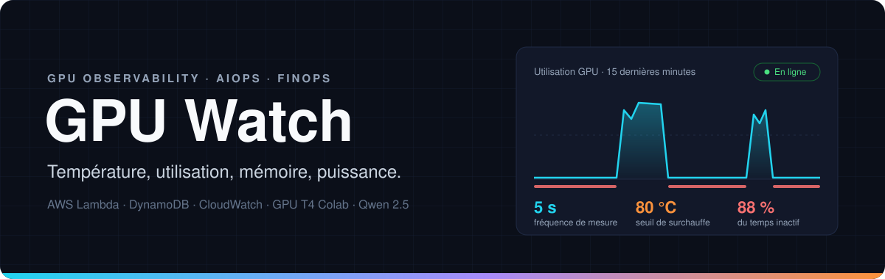
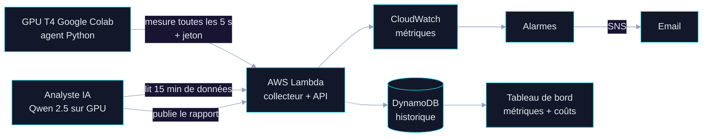

<p align="center">
  
</p>

<p align="center">
  
  
  
  
  
</p>

<p align="center">
  <a href="#aperçu"><b>Aperçu</b></a> ·
  <a href="#résultats"><b>Résultats</b></a> ·
  <a href="#architecture"><b>Architecture</b></a> ·
  <a href="#démarrage-rapide"><b>Démarrage rapide</b></a> ·
  <a href="#estimation-des-coûts"><b>Coûts</b></a> ·
  <a href="#feuille-de-route"><b>Feuille de route</b></a>
</p>

---

## Aperçu

**GPU Watch** surveille l'état d'un GPU en temps réel. Toutes les 5 secondes, il relève sa **température**, son **taux d'utilisation**, sa **mémoire occupée** et sa **puissance consommée**, les affiche dans un tableau de bord et déclenche une alerte par email en cas de surchauffe ou d'inactivité prolongée.

Le projet tourne sur le **GPU T4 mis à disposition gratuitement par Google Colab** : aucun GPU n'a été acheté ni loué. Les mesures sont lues avec `nvidia-smi`, l'outil fourni par Colab, puis envoyées sur AWS.

Un modèle de langage open source, exécuté sur ce même GPU, rédige en français un diagnostic à partir de faits calculés par le code. En complément, l'outil estime ce que coûterait le même usage sur un GPU loué chez AWS.

> **En une phrase** : un tableau de bord qui montre à tout moment si le GPU chauffe, travaille ou attend pour rien.

<p align="center">
  
</p>

## Résultats

Session de test de 17 minutes sur le GPU T4 de Google Colab.

| Indicateur | Valeur |
|:---|---:|
| Métriques suivies | température, utilisation, mémoire, puissance |
| Fréquence de mesure | toutes les 5 s |
| Seuil d'alerte de surchauffe | 80 °C |
| Délai d'alerte en cas de surchauffe | ~ 1 min |
| Temps d'inactivité du GPU (utilisation < 10 %) | **88 %** |

## Fonctionnalités

<table>
  <tr>
    <td width="50%" valign="top">
      <b>Télémétrie GPU</b><br>
      Température, utilisation, mémoire et consommation électrique, relevées toutes les 5 secondes.
    </td>
    <td width="50%" valign="top">
      <b>Alertes</b><br>
      Alarmes CloudWatch de surchauffe (> 80 °C) et d'inactivité prolongée, notifiées par email via Amazon SNS.
    </td>
  </tr>
  <tr>
    <td valign="top">
      <b>Tableau de bord temps réel</b><br>
      Jauges et courbes des 15 dernières minutes, alimentées par un historique DynamoDB.
    </td>
    <td valign="top">
      <b>API serverless sécurisée</b><br>
      Ingestion protégée par jeton, sans serveur à maintenir, avec des droits IAM minimaux.
    </td>
  </tr>
  <tr>
    <td valign="top">
      <b>Diagnostic par IA</b><br>
      Un LLM open source rédige un rapport en trois parties : activité, coûts, recommandations.
    </td>
    <td valign="top">
      <b>Estimation des coûts</b><br>
      Ce que coûterait le même usage sur AWS, part perdue pendant l'inactivité et économies possibles.
    </td>
  </tr>
</table>

## Architecture



Une seule fonction Lambda assure trois rôles :

| Requête | Rôle |
|:---|:---|
| `POST /` + en-tête `x-jeton` | Réception d'une mesure ou d'un rapport IA |
| `GET /` | Tableau de bord |
| `GET /?donnees=1` | Mesures des 15 dernières minutes (JSON) |
| `GET /?analyse=1` | Dernier rapport de l'IA (JSON) |

## Choix de conception

**Python calcule, l'IA rédige.** Les petits modèles de langage se trompent dans les calculs, les comparaisons de nombres et les durées. Toutes les statistiques, périodes d'activité, montants et dépassements de seuil sont calculés en Python ; le modèle a pour consigne stricte de les reprendre tels quels.

**Ancrage des connaissances.** Interrogé sur les instances Spot, le modèle inventait des critères faux. Les faits lui sont désormais fournis dans la requête : on ne compte pas sur ce qu'il sait, on lui donne ce qu'il doit dire.

**Serverless et moindre privilège.** Aucun coût quand rien ne tourne, aucun serveur à maintenir, des secrets hors du code et une politique IAM limitée aux seules actions nécessaires.

**Paiement à l'heure ou au token.** Sur un GPU loué à l'heure, l'analyste IA resterait inactif l'essentiel du temps : précisément le gaspillage que l'outil mesure. Pour une charge aussi faible, un modèle facturé au token serait plus économique ; un GPU dédié devient rentable avec un volume de requêtes élevé et continu.

## Démarrage rapide

**1. AWS**

```text
DynamoDB   table "gpu-watch-mesures"   clé de partition : gpu (chaîne)   clé de tri : horodatage (chaîne)
Lambda     Python 3.13, code : lambda/lambda_function.py
           variables : TABLE=gpu-watch-mesures   JETON=<jeton secret>
           rôle : aws/iam-policy.json   +   URL de fonction (authentification NONE)
CloudWatch gpu-surchauffe : Temperature max (1 min) > 80
           gpu-inactif    : Utilisation moyenne (5 min) < 10, 2 périodes sur 2
```

Générer un jeton secret :

```python
import secrets; print(secrets.token_hex(16))
```

**2. Google Colab**

1. Ouvrir un carnet avec un GPU T4.
2. Ajouter les Secrets Colab `GPU_WATCH_URL` et `GPU_WATCH_JETON`.
3. Exécuter dans l'ordre les cellules de `colab/gpu_watch_colab.py`.
4. Ouvrir l'URL de la fonction : le tableau de bord s'affiche.

## Structure du dépôt

```text
gpu-watch/
├── lambda/lambda_function.py     collecteur, API et tableau de bord
├── colab/gpu_watch_colab.py      agent de mesure, analyste IA, calcul des coûts
├── aws/iam-policy.json           permissions minimales
└── docs/                         bannière et captures
```

## Estimation des coûts

Le GPU de Colab est gratuit. Pour donner un ordre de grandeur, GPU Watch estime ce que coûterait le même usage sur une instance AWS g4dn.xlarge, équipée du même GPU T4.

Mesures relevées lors d'une session de test de 17 minutes sur le GPU T4 de Google Colab, valorisées au tarif d'une instance AWS g4dn.xlarge équivalente.

| Indicateur | Valeur estimée |
|:---|---:|
| Coût de la période | 0,145 $ |
| Dont payé pour rien | **0,128 $** |
| Gaspillage projeté sur un mois, au même rythme | **339 $** |
| Économie possible avec arrêt automatique + instance Spot | **363 $ / mois** |

### Méthode de calcul

| Étape | Formule |
|:---|:---|
| Coût d'une mesure | 0,526 $/h × 5 s / 3600 s ≈ 0,00073 $ |
| Mesure inactive | utilisation inférieure à 10 % |
| Argent gaspillé | mesures inactives × coût d'une mesure |
| Projection mensuelle | 730 h × 0,526 $ ≈ 384 $, dont gaspillé : 384 $ × part d'inactivité |
| Option 1 : arrêt automatique | 730 h × part d'activité × 0,526 $ |
| Option 2 : arrêt automatique + Spot | 730 h × part d'activité × 0,25 $ |

<details>
<summary><b>Hypothèses de calcul</b></summary>
<br>

- Le GPU de Google Colab est gratuit : le calcul estime ce que coûterait le même usage sur une instance AWS g4dn.xlarge (us-east-1, 0,526 $/h à la demande, environ 0,25 $/h en Spot, prix Spot variable).
- La projection suppose que le rythme observé se maintient 24 h/24 pendant un mois.
- L'économie de l'arrêt automatique est un maximum théorique : redémarrage et sauvegarde du travail ont un coût.
- Une instance Spot peut être reprise par AWS avec 2 minutes de préavis : elle convient aux calculs interruptibles, pas aux services permanents.

</details>

## Feuille de route

- [x] Télémétrie GPU et ingestion serverless
- [x] Tableau de bord temps réel
- [x] Alarmes de surchauffe et d'inactivité
- [x] Diagnostic rédigé par IA, ancré sur des faits calculés
- [x] Estimation des coûts et du gaspillage
- [ ] Arrêt automatique réel d'une instance EC2 inactive
- [ ] Prix en direct via l'API AWS Price List
- [ ] Vue multi-GPU et agrégation du gaspillage par équipe
- [ ] Déploiement en infrastructure as code (CloudFormation)

## Limites

Projet personnel, non destiné à la production. Les rapports de l'IA proviennent d'un modèle de 3 milliards de paramètres et doivent être relus ; les chiffres de référence sont ceux affichés sur les cartes, calculés par le code.

---

<p align="center">
  <sub>AWS Lambda · Amazon DynamoDB · Amazon CloudWatch · Amazon SNS · IAM · Python · JavaScript · Chart.js · CUDA · Hugging Face Transformers · Qwen 2.5</sub>
</p>
